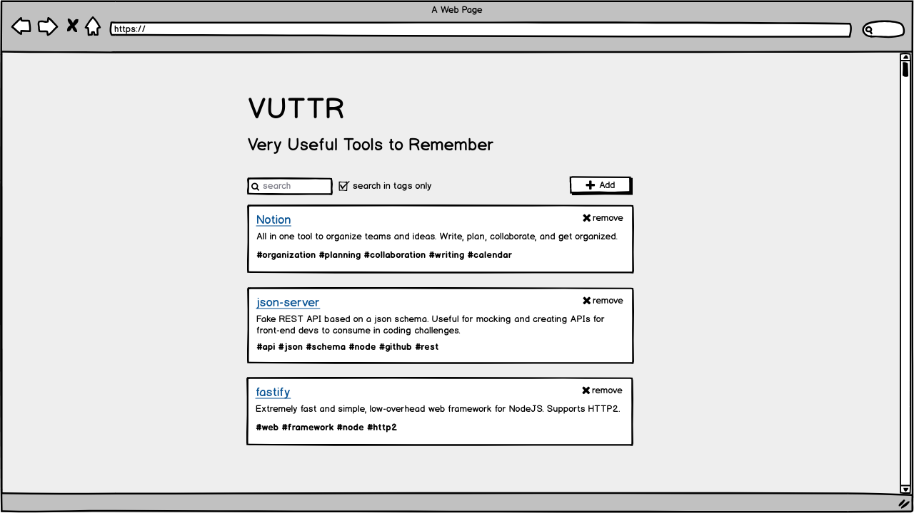
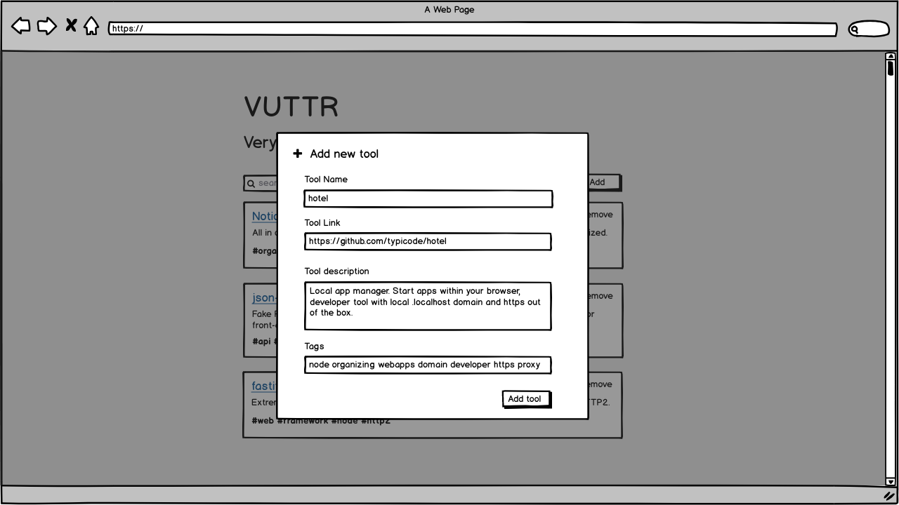
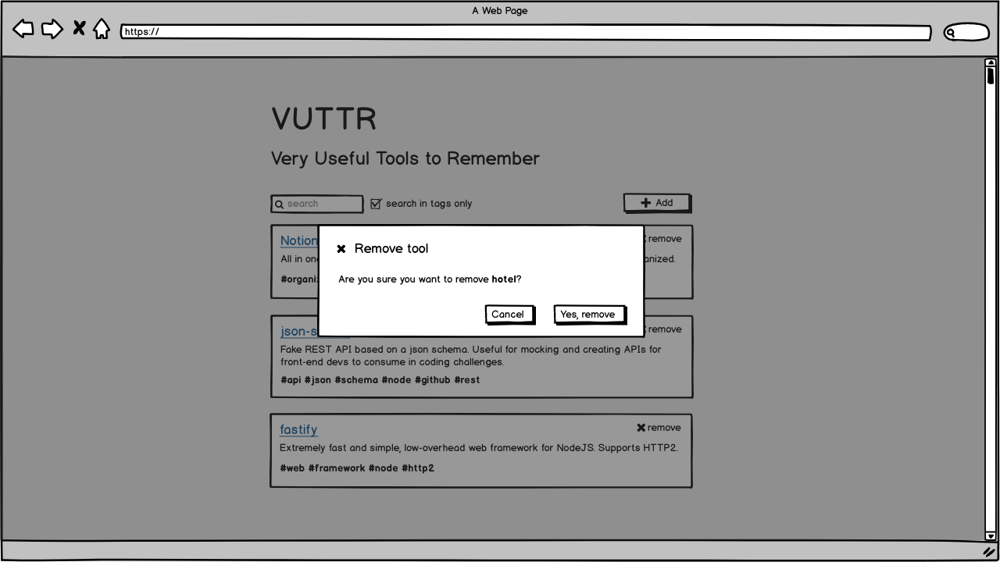
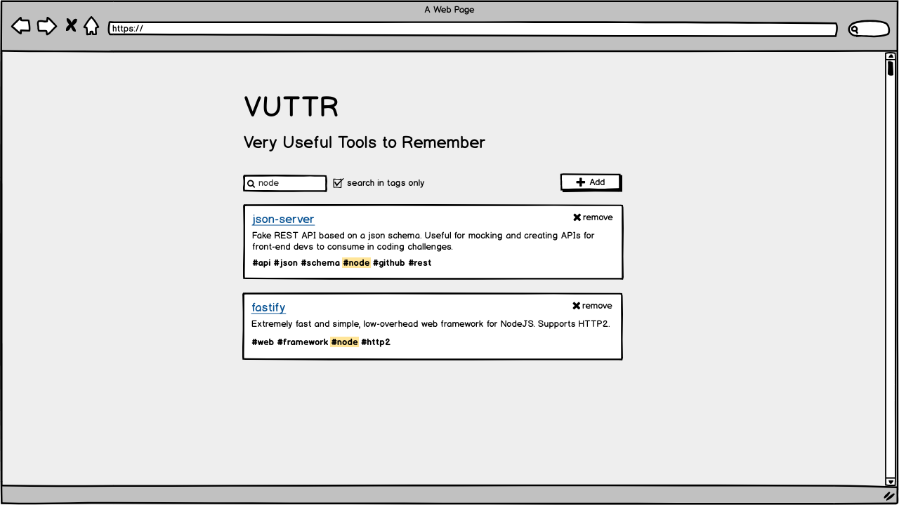

# Front End

Your task is to build a front-end for the VUTTR (Very Useful Tools to Remember) application. The application is a simple repository to manage tools with their respective names, links, descriptions and tags.

The front-end should be built using any JavaScript framework you like (React, Vue.js, Angular, etc...) and following the wireframes presented below.

### What will be assessed

We want to assess your ability to develop and document a front-end for a back-end ready application.  
Will be evaluated:

- Well-written and clean code;
- What tools were used, how and why;
- Your knowledge of JavaScript, HTML and CSS;
- Your ability to commit to what was provided (wireframes);
- Your ability to document your part of the application.

## Wireframes

### 1: The user should be able to see the list of all registered tools



### 2: The user should be able to add a new tool



### 3: The user should be able to remove a tool



### 4: The user should be able to search tools dynamically (globally or using only tags)



## API

You can run the API with the command:

```
npm run api
```

### Endpoints:

| Method   | Url                        | Action                                                     |
| -------- | -------------------------- | ---------------------------------------------------------- |
| `GET`    | `/tools`                   | return list of tools                                       |
| `POST`   | `/tools`                   | create new tool from data in body                          |
| `DELETE` | `/tools/:id`               | delete tool by given id                                    |
| `GET`    | `/tools?q=:search`         | return list of tools filtered by given query string        |
| `GET`    | `/tools?tags_like=:search` | return list of tools with tags like the given query string |
